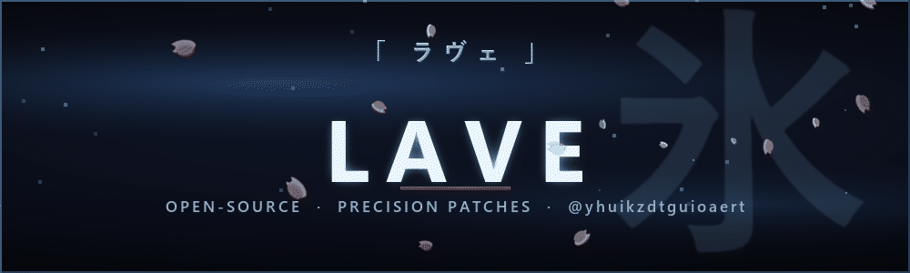

<!-- ╔══════════════════════════════════════════════════════════════╗
     ║   LAVE · profile README — icy "miyabi" aesthetic              ║
     ║   Banner + divider are generated locally (assets/), so they   ║
     ║   never break. Stats/typing use standard services.            ║
     ╚══════════════════════════════════════════════════════════════╝ -->

 

 

 

## ❄️ About

I contribute focused fixes to developer tools and desktop applications. I keep
changes small enough to review, explain the exact behavior being changed, and
add regression coverage wherever a project has a suitable test seam.

> **Precision over volume.** Reproduce first, patch the root cause, prove it with a test.

## ⚔️ Where I'm helping out

| Pull request | Stack | What it does |
| :--- | :---: | :--- |
| **[dotenvy #172](https://github.com/allan2/dotenvy/pull/172)** |  | Keep substitution disabled when configured off. |
| **[pairing-bot #118](https://github.com/recursecenter/pairing-bot/pull/118)** |  | Simplify recurser cache updates around a single source of truth. |
| **[lookit #162](https://github.com/jonathandeamer/lookit/pull/162)** |  | Scroll repeated links to the focused rendered occurrence, with regressions. |
| **[Telegram Desktop #31149](https://github.com/telegramdesktop/tdesktop/pull/31149)** |  | Keep an empty global-search field focused on Backspace. |
| **[FTW baselines #273](https://github.com/fieldsoftheworld/ftw-baselines/pull/273)** |  | Make polygon simplification, morphology & area filtering metre-safe. |
| **[Obelisk #69](https://github.com/tommy0103/obelisk/pull/69)** |  | Remove Kimi injection messages inside an undone transcript range. |
| **[MoonDownloader #169](https://github.com/LeyckerS/moondownloader/pull/169)** |  | Explain the effective datanodes ceiling from extractor & page limits. |
| **[Solid Primitives #1015](https://github.com/solidjs-community/solid-primitives/pull/1015)** |  | Pass reactive custom props through `MultiProvider`, preserving context semantics. |
| **[Rod #1240](https://github.com/go-rod/rod/pull/1240)** |  | Avoid returning a stale JS helper after a concurrent context reset. |
| **[Jiti #460](https://github.com/unjs/jiti/pull/460)** |  | Honor caller Stage-3 decorator transforms without the conflicting legacy one. |
| **[Quicktype #3127](https://github.com/glideapps/quicktype/pull/3127)** |  | Emit compilable TS index signatures for mixed declared + additional props. |
| **[lo #977](https://github.com/samber/lo/pull/977)** |  | Capitalize only upper-cases the first character, lower-casing the rest. |

## 🩸 Working approach

- **Reproduce first** — characterize the behavior before touching a line.
- **Respect the house** — follow each repository's contribution and style rules.
- **Prove it** — add focused tests where practical and record the exact verification commands.
- **Stay on it** — available for CI failures and maintainer review.

## 📊 Stats

<!-- NOTE: two stats services were unusable at build time and are intentionally left out
     so nothing renders broken:
       - github-readme-stats (stats + top-langs cards) was rate-limited (HTTP 503)
       - github-readme-streak-stats rendered a "Failed to retrieve contributions" error card
     They often recover. To add the classic stats + top-langs cards back, uncomment:

-->

 

